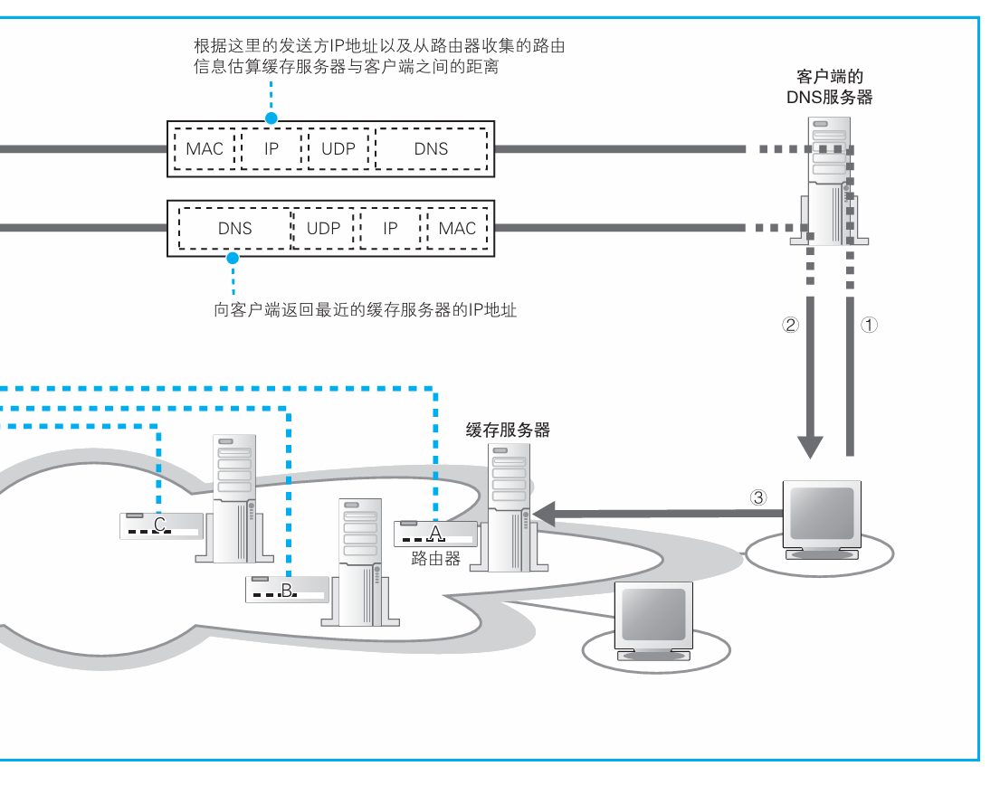

### 如何找到最近的缓存服务器

> 本节介绍：客户端发起DNS查询，服务器端的DNS服务器收集所有缓存服务器的路由信息，通过路由信息得知离客户端最近的缓存服务器。

内容分发服务为客户端提供了很多可访问的缓存服务器，互联网采用几种自动分配的机制来让客户端访问距离自己最近的缓存服务器。

其中之一是通过DNS查询的方式来让DNS服务器返回举例最近的缓存服务器的IP地址。

> 一般来说，客户端向所在局域网的DNS服务器发起查询，该DNS服务器向域名中的最高一级DNS服务器询问，一层一层查下去，直到查到Web服务器所在的局域网的DNS服务器，然后从这里得到Web服务器的IP地址，并将该地址返回给客户端。
>
> 
>
> 上图所示是Web服务器只对应一个IP地址的情况。

在Web服务器所在局域网的DNS服务器中提前准备了缓存服务器所在的路由器的路由信息，根据路由信息可以查到不同缓存服务器到客户端的大致距离，这样就知道了哪个缓存服务器距离客户端最近，并返回那个缓存服务器的IP地址。

