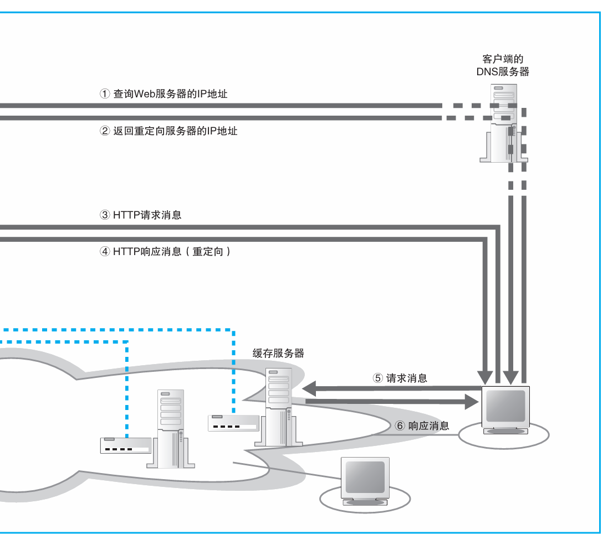
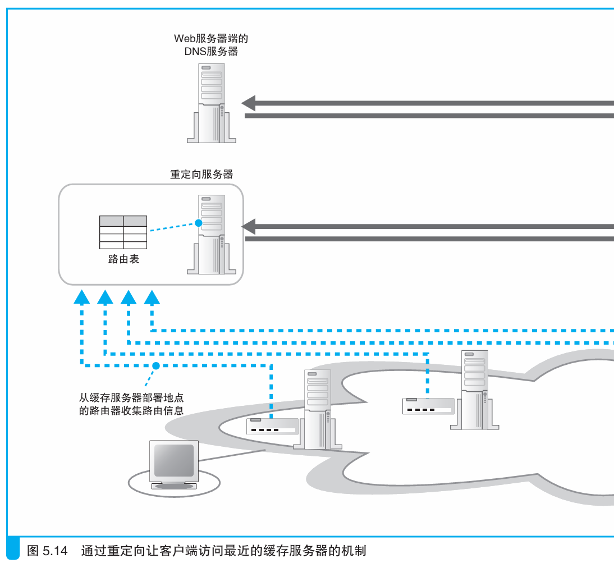
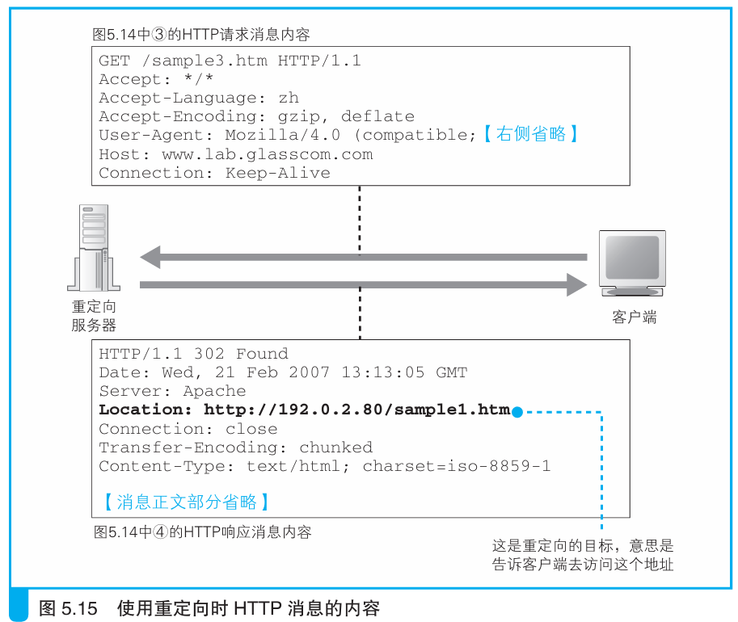

### 通过重定向服务器分配访问目标

> 本节介绍：重定向服务器收集了不同缓存服务器的路由信息，通过路由信息分配给客户端距离最近的缓存，或者使用一种时间计算的脚本来计算不同缓存数据收发的时间从而得知最近缓存。

重定向服务器代替Web服务器被注册在Web服务器所在局域网的DNS上，客户端通过DNS找到重定向服务器，把请求消息先发给重定向服务器。重定向服务器返回的网络包头部有一个Location字段，这个字段中就标明了客户端要去找哪个缓存服务器。

> Location是HTTP规定的头部字段之一，该字段表示发送方请求的信息不在接收方上，应该去该字段标明的服务器查找。

重定向服务器收集了各个缓存所在的路由器的路由信息，根据路由信息可以得知哪个缓存离客户端最近。相较于DNS查询，重定向服务器计算缓存到客户端IP地址的距离，因此精度更高，但是消息收发的次数更多，导致开销更大。

除了发送带有Location字段的包，重定向服务器也可以返回计算客户端到缓存服务器往返时间的脚本，客户端运行该脚本，就能发送测试包来测算到不同缓存服务器之间的时间大小，然后选择时间最短的缓存。

