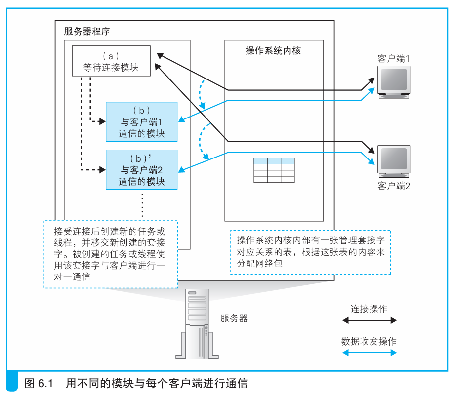

### 服务器程序的结构

> 本节介绍：服务器的连接模块专门用来创建套接字进行连接，客户端通信模块专门用来响应客户端需求。一般有一个连接模块，多个客户端通信模块。

服务器每连接一个客户端，就启动一个服务程序。

服务器程序结构如下图所示，分为两个模块，一个是等待连接模块，一个是客户端通信模块。



上图中的程序执行流程如下所示：

``` Mermaid

graph TD

A[服务器启动并完成准备工作] --> B[启动等待连接模块];
B --> C[等待连接模块创建套接字];
C --> D[等待连接模块挂起];
D --> E[客户端访问]
E --> F[等待连接模块恢复运行并接受连接]
F --> G[等待连接模块启动并移交套接字给客户端连接模块]
G --> H[客户端连接模块开始通信]
G --> C
H --> I[通信结束模块退出]

```

上述流程基于服务器操作系统所有的多任务、多线程功能运行，这个过程需要每次有客户端发起请求时都要启动一次客户端通信模块，比较耗时，解决这一问题可以采用在连接之前事先启动几个客户端通信模块的方法。