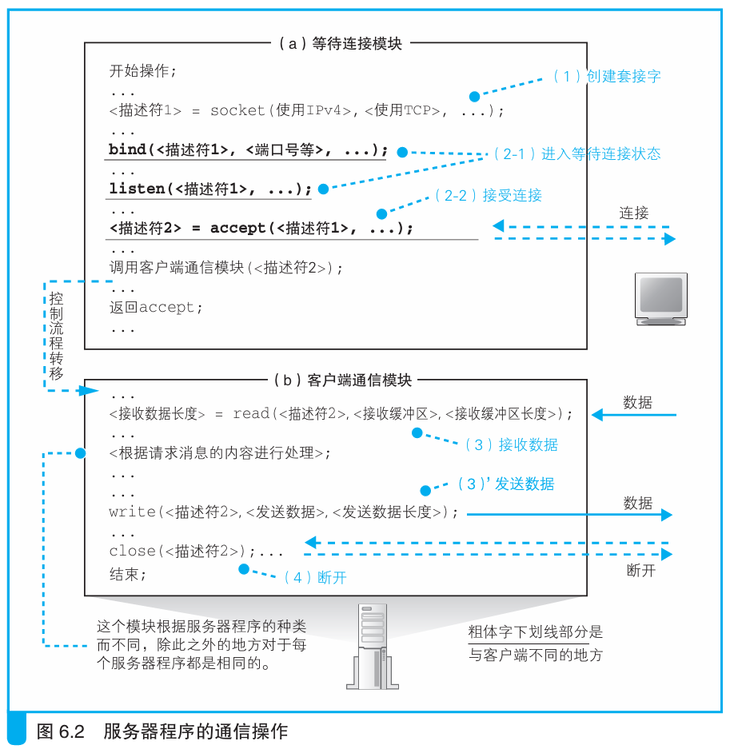
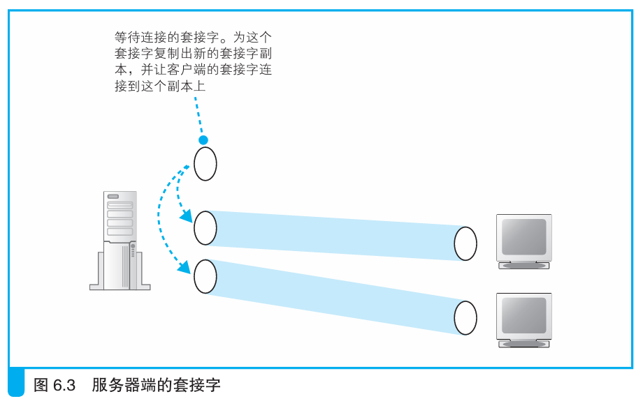
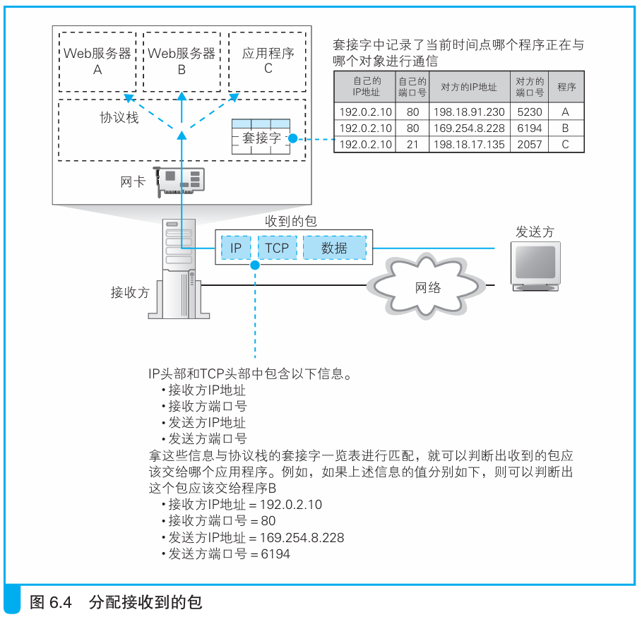
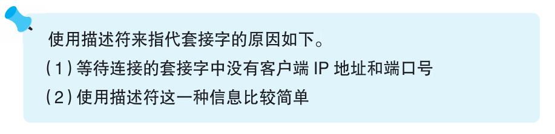

### 服务器端的套接字和端口号

> 本节介绍：服务器每连接一个客户端就创建一次套接字，由于提供的服务相同，这些套接字也在同一个端口上，为了加以区分，连接过程中用连接双方的IP地址和端口号来区分这些套接字。

收据收发的双方用谁等待连接，谁主动连接来区分发送方和接受方，其主要体现在对Socket库程序的调用上，如下所示：

> **客户端数据收发**
> 
> 1. 创建套接字（创建套接字阶段）
> 2. 用管道连接服务器端的套接字（连接阶段）
> 3. 收发数据（收发阶段）
> 4. 断开管道并删除套接字（断开阶段）
>
> **服务器数据收发**
> 1. 创建套接字（创建套接字阶段）
> 2. 将套接字设置为等待连接状态（等待连接阶段）
> 3. 接受连接（接受连接阶段）
> 4. 收发数据（收发阶段）
> 5. 断开管道并删除套接字（断开阶段）

下图使用伪代码展示了服务器建立连接的操作：

在上图中，协议栈调用socket创建套接字，然后调用bind把端口号写入套接字，比如一般默认Web服务端口号就是80。

接着协议栈调用listen向套接字中写入等待连接的控制信息，然后调用accept接受连接，如果没有包达到就转为等待包到达的状态，如果有包到来就继续执行接受连接的操作。

请求消息会送到这个套接字，紧跟着协议栈返回响应包，但接下来并不会把通信对象的控制信息写在这个套接字，而是新建一个该套接字的副本，把控制信息写入副本中。这样做的结果就是客户端与新建的套接字连接，而原来的套接字则始终处于等待连接的状态，等着下一个客户端过来连接。

创建新副本并完成连接操作后，accept的任务也就完成了。接下来等待连接模块启动客户端通信模块并转交套接字，通信开始。

值得说明的是，上述复制套接字的过程中除了写入通信对象的控制信息，原来套接字的端口号也一并复制了过来，为了保证客户端消息能正确分配到自己对应的套接字，服务器采用客户端和服务器双方的IP地址和端口号四个特征来识别套接字。

在套接字刚创建好的时候使用描述符来指定套接字。

