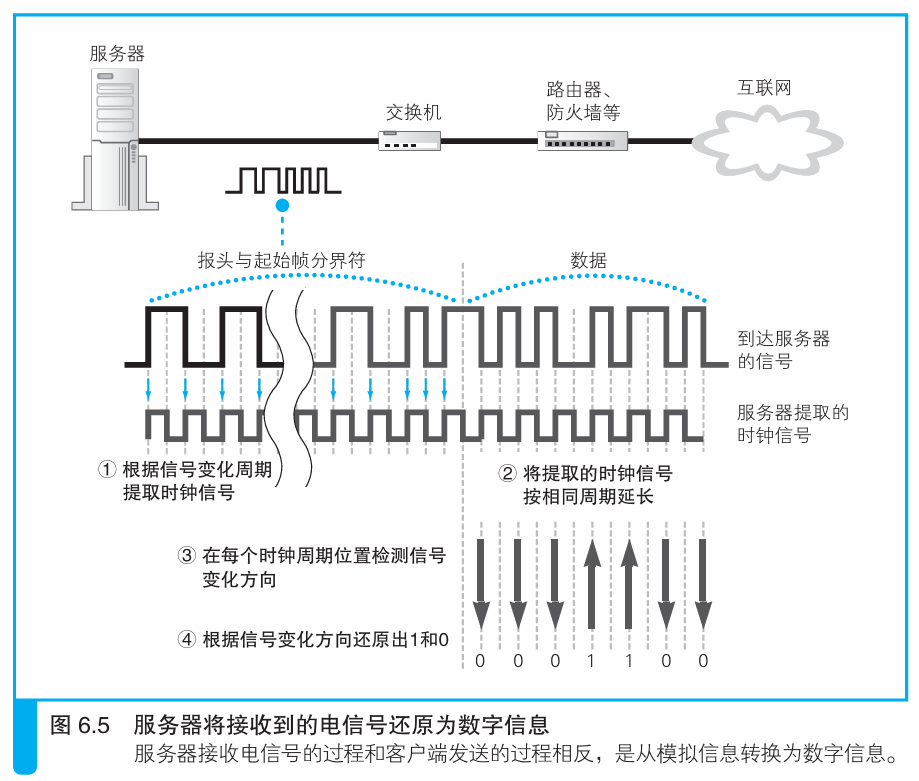
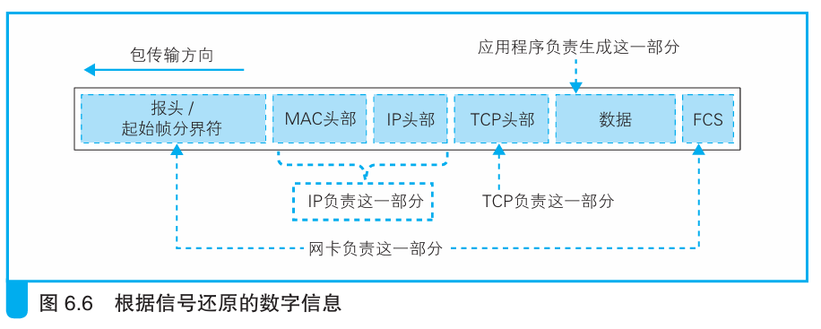

### 网卡将接收到的信号转换成数字信息

> 本节介绍：服务器将电信号转换为数字信号的过程与客户端没什么不同。MAC模块将电信号转换为数字信号然后放入网卡的接收缓冲区，网卡驱动程序调用TCP/IP模块处理网络包的请求。

网络包以电信号或者光信号的形式被发到服务器端，服务器网卡的MAC模块接收信号后，将信号转换为数字信息。

以电信号的`10BASE-T`为例，电信号被MAC模块接收后，MAC模块查看网络包的报头，报头中的频率就是时钟信号的频率。将时钟信号提取出来，根据时钟信号每个周期处网络包电信号的变化，得到对应的二进制数字信息。

接下来根据包末尾的帧校验序列FCS校验错误。如果计算得到的FCS与网络包给出的FCS一致，说明没有错误。然后查看MAC头部的接收方MAC地址，是自己的就留下放在网卡缓冲区中，不是就丢弃。

网络包放在缓冲区后，网卡使用中断通知CPU，然后CPU调用网卡驱动程序从缓冲区取出包，根据MAC头部的以太类型判断该包属于哪一类，一般都是IP协议类型，该包被网卡驱动程序交给TCP/IP协议栈。

