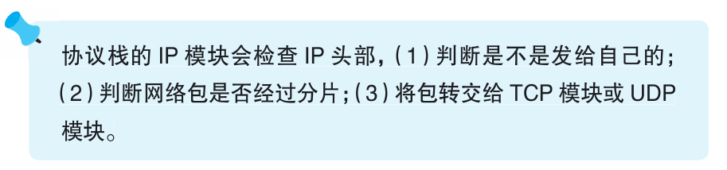

### IP 模块的接收操作

> 本节介绍：IP模块收到网络包后，要查接收方IP地址，查分片，查协议号，这一步和客户端的操作是一样的。

MAC模块将网络包交给协议栈IP模块，IP模块首先检查IP头部的格式，然后检查接收方IP地址。服务器操作系统内置了路由器功能和防火墙功能，当发现网络包的接收方IP不是自己，那么开启路由功能的服务器会把包转发出去。

确认是发给自己的包后，检查头部的分片字段，如果分片了就暂时放在内存，等发完了重组一下。

如果没有分片或者重组完成，就根据头部的协议号判断消息采用什么协议，如果是06H，就交给TCP模块，如果是11H，就交给UDP模块。

