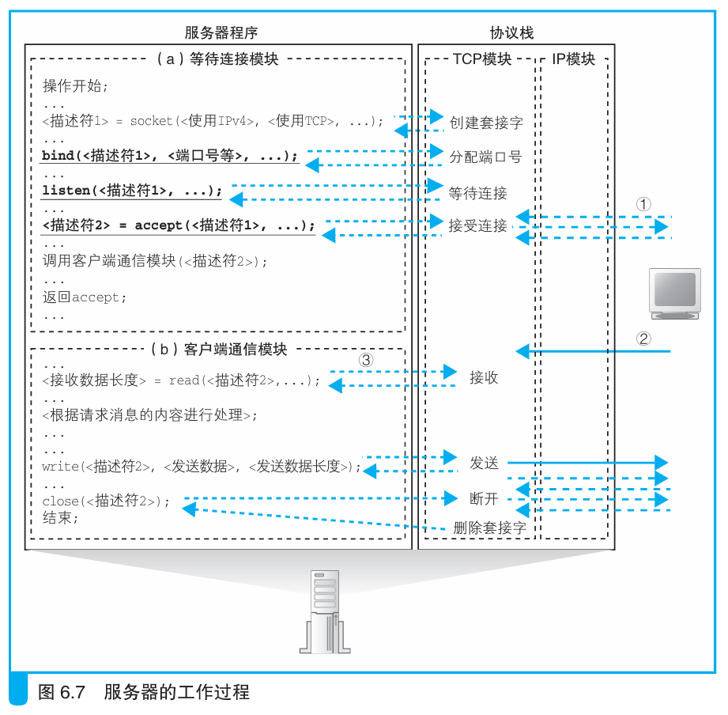
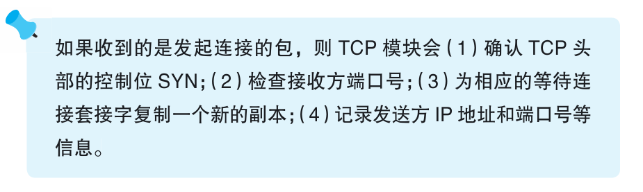

### TCP 模块如何处理连接包

> 本节介绍：TCP模块要检查包头部的SYN号，检查端口号，然后复制套接字写入控制信息，分配数据收发缓冲区，生成ACK号、序列号、窗口大小响应客户端。

检查SYN号为1，进行连接操作。检查包指定接收方的端口号对应的端口是否有等待连接的套接字，没有就返回ICMP消息通知错误给客户端。

端口有等待连接的套接字，复制该套接字并写入客户端的控制信息，分配内存空间作为收发数据的两个缓冲区。接着TCP模块生成ACK号、序号初始值、窗口大小作为TCP头部内容并委托IP头部返回给客户端。

客户端收到并返回ACK号，就表示连接完成了。此时服务器的accept程序进入暂停状态，等到新套接字的描述符交给服务器程序，服务器程序就会继续运行。

