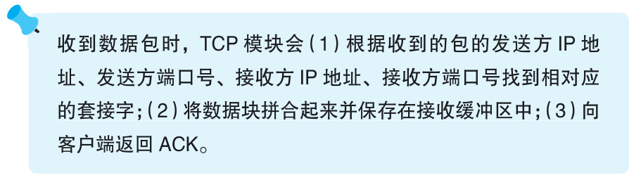

### TCP 模块如何处理数据包

> 本节介绍：TCP模块收到数据包后首先检查数据包属于哪个套接字，然后检查数据包的包头并判断是否放入接收缓冲区。放入缓冲区的包被交给应用程序处理。

TCP模块根据包头部中发送方和接收方的IP地址和端口号确定该包属于哪一个套接字，然后TCP根据套接字中记录的上一个包的序号信息判断该包的序号信息是多少，如果序号正确，说明没有丢失包，将该包中数据放到接收缓冲区，与上一个数据块连接起来。

接收的包放入数据缓冲区后，TCP模块会根据包的长度和序号计算出ACK号，生成TCP头部，作为响应包。如果等待一段时间后有新的响应包生成，则合并响应包返回给客户端。

一般来说，应用程序会在接收到数据前调用Socket库的read程序，进入等待状态，当TCP把数据块放入接收缓冲区并完成合并，就意味着数据接收操作完成，read程序就会取走数据交给应用程序。

接下来控制流程转交到服务器程序，由服务器程序对数据进行处理。

