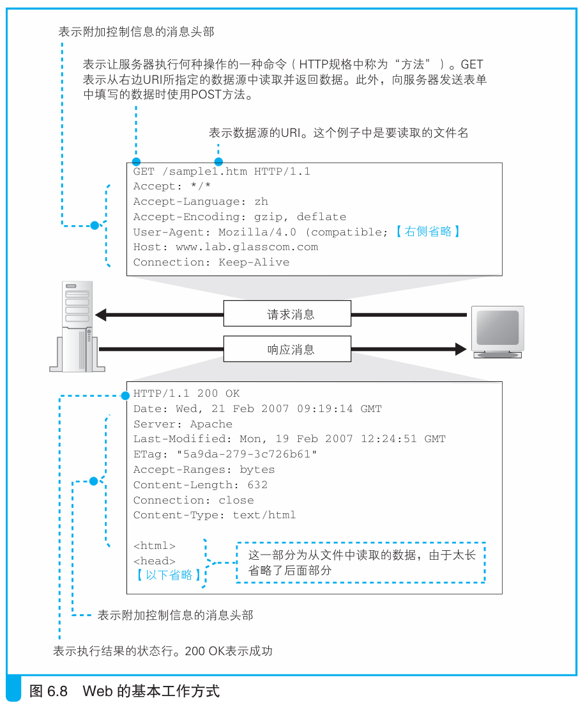
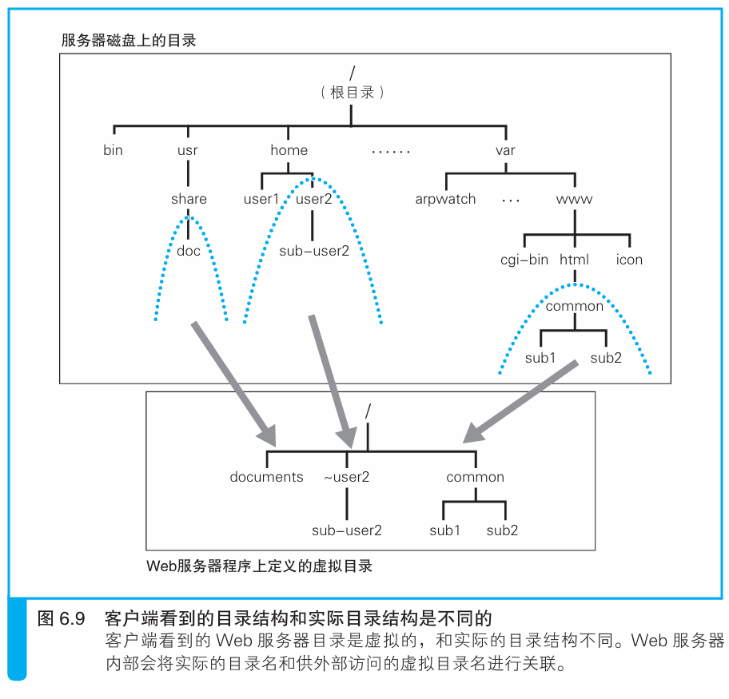

### 将请求的URI转换为实际的文件名

> 本节介绍：网络包中请求的URI是Web服务器给出的虚拟文件路径，服务器要处理及返回客户端需要的数据，就要将URI转换为实际文件名。

Web服务器程序调用Socket库的read程序获取HTTP请求消息，然后查看请求消息中的请求方法和URI。请求方法是客户端要求以何种方式处理和返回数据，URI则是客户端要求处理和返回的数据路径所在。

> <i>对于UNIX系操作系统的服务器来说，URI的路径名和磁盘文件的路径名格式是相同的，对于Windows也只要将“/”替换成“\”就可以了，因此我们可以将URI当作是磁盘文件的路径名。</i>

最简单的一种情况是请求方式为GET，请求的文件是一个html文件，如下图所示：

服务器只需返回客户端指定的html文件的内容即可，但在访问这个文件前需要进行路径转换，因为一般服务器不会把自己的真实磁盘路径暴露给外界，而是采用虚拟路径，以防止外来网络包请求到隐私文件，如下图所示：

按照上图所示，如果虚拟路径是 `/~user2/sub-user2/sample.html` ，那么实际路径就是 `/home/user2/sub-user2/sample.html` 。

上面这个例子中给出的虚拟路径文件在真实路径中也存在，但也有一些特殊情况，比如虚拟路径中没有指定文件，或者给出的虚拟路径在真实路径中根本不存在。

如果虚拟路径没有指定文件，比如客户端访问 `http://www.glasscom.com/tone/` ，那么服务器处理时会自动加上事先设置好的默认文件名，也就是 `http://www.glasscom.com/tone/index.html` 。

有的时候服务器的文件路径更改了，但想要客户端仍然访问原来的路径，这时候就会有事先设定好的转换规则，当客户端输入原来的路径名，服务器自动转换为新更改好的路径名。