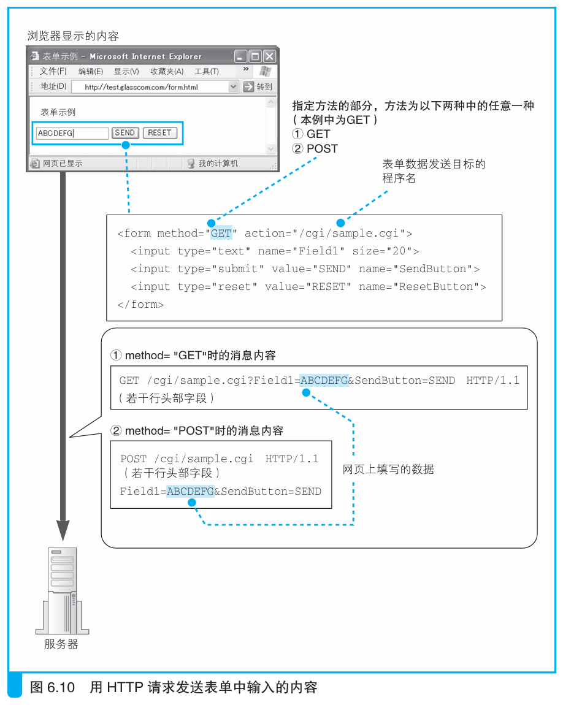
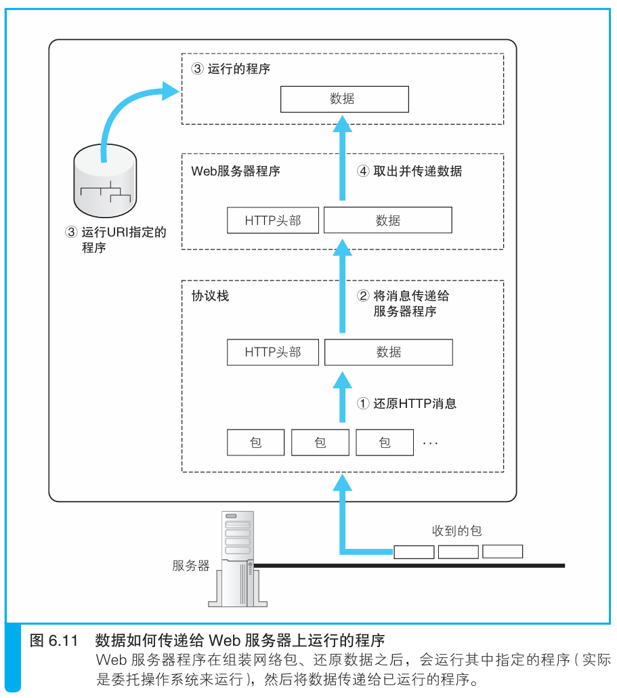

### 运行CGI程序

> 本节介绍：服务器根据URI找到客户端访问的CGI程序，CGI程序根据请求方法和客户端给出的数据进行处理，处理完成的数据放在HTTP消息中返回给客户端。

客户端有时候想要访问服务器程序文件，希望程序文件根据输入的数据给出结果，不同程序文件的运行方式不同，下面主要介绍一下CGI程序的运行。

客户端访问CGI程序的话一般会把数据放在HTTP消息中，如果请求方法时GET，数据就会放在URI后面；如果请求方法是POST，数据就会放在消息体中。

收到请求消息后，Web服务器会查看URI指定的文件是否是程序文件。

> 判断文件类型的方式一般是提前设置好的，这里简单介绍三种：
>
> - 根据文件后缀名判断，文件名如*.cgi，*.php都是程序文件；
>
> - 将程序文件统一放在一个目录下，只要客户端访问到这个目录下就默认是访问程序文件；
>
> - 查看文件属性

确认是程序文件后，Web服务器委托操作系统执行该程序，并从消息中取出数据交给该程序。

程序运行结束后将数据处理的结果交给Web服务器，Web服务器将生成的数据嵌入到http消息中，返回给客户端。

