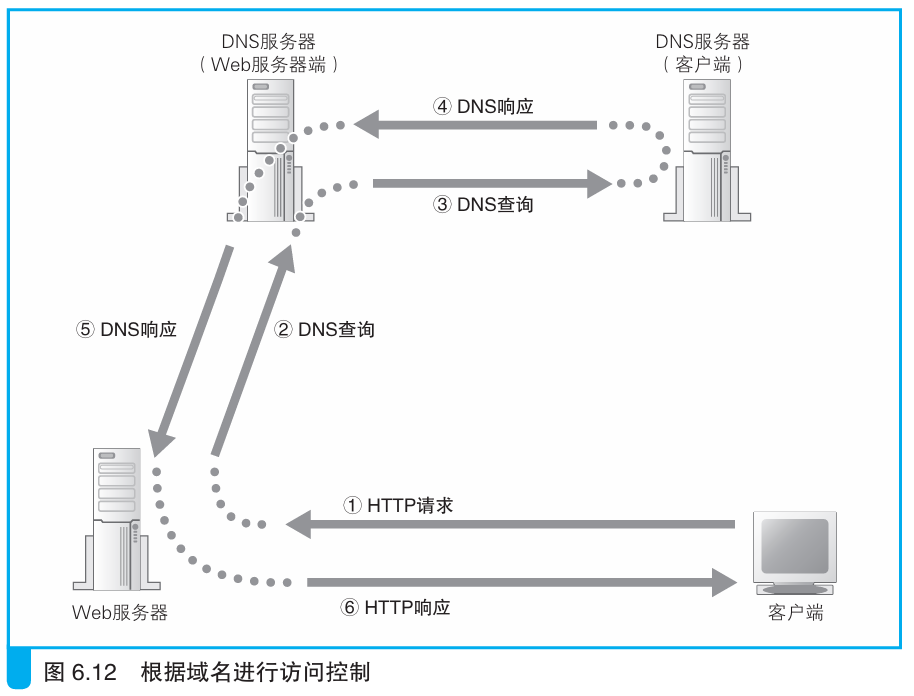
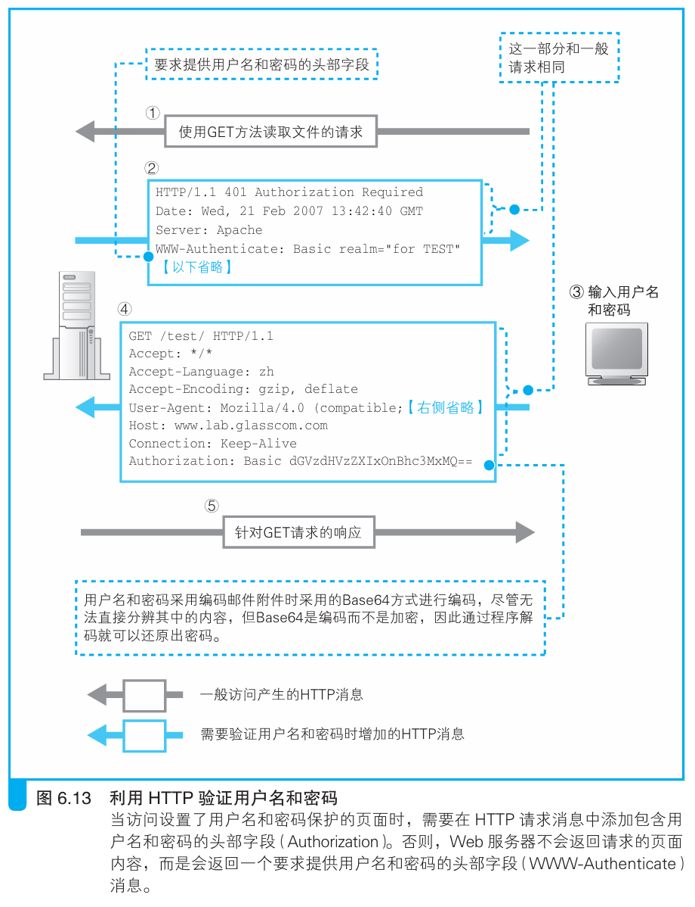

### Web 服务器的访问控制

> 本节介绍：Web服务器的某些数据遭受客户端访问时，需要判断客户端是否有访问权限，一般可以通过域名、IP地址、用户名和密码来判断客户端权限。

Web服务器需要设置访问控制规则，保证一些文件只会被有权限的用户成功访问。

Web服务器设置访问控制规则主要有三种：

> - 客户端IP地址
>
> - 客户端域名
>
> - 用户名和密码

服务器在数据所在的目录或文件提前设置好访问规则，当客户端请求消息访问某个文件时，查看该文件的访问规则和客户端信息，来判断客户端是否有访问权限。

如果是根据IP地址设置访问规则，那么服务器接收网络包时直接取出IP地址查看是否符合规则即可。

如果是根据域名设置访问规则，那么接收到包之后需要使用IP地址通过DNS服务器反向查询域名，其过程跟用域名查询IP地址差不多，先把包含IP地址的请求包发给默认网关的DNS服务器，再由该DNS服务器找到IP地址对应的DNS服务器找到域名，然后把域名返回给Web服务器。

找到域名后还需要用该域名再查一遍其对应的IP地址，这是为了防止别人注册假域名。只有域名和IP地址两者都正确后才会查询其权限，因此这种方式需要耗费时间，Web服务器响应慢。

如果是根据用户名和密码进行访问，那么一般客户端先发送一个请求访问但不包含用户名和密码的消息，然后服务器返回一个通知需要用户名和密码的响应消息，客户端收到后在浏览器弹出表单，用户完成填写后由客户端将用户名和密码放入网络包发给服务器，服务器接收到用户名和密码进行权限确认，如果有访问权限则返回用户需要的数据。

> <i>这里介绍的内容是使用Web服务器提供的密码认证功能时的工作过程，除此之外，还可以通过Web服务器运行CGI认证程序来验证密码。这种情况下，认证程序会生成一个含有密码表单的网页并发送给用户，用户填写密码后发送回服务器，由认证程序进行校验。这种方式会包含密码表单页面和用户提交的密码数据的交互过程，因此和图6.13的过程是有区别的。</i>