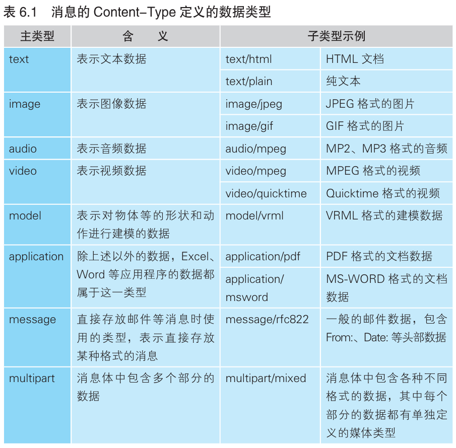

### 通过响应的数据类型判断其中的内容

> 本节介绍：客户端收到响应内容后，需要根据数据类型来判断应该用哪个程序来将二进制信息转换为屏幕上的图像信息。数据类型可以根据网络包头部或者数据内容的标识判断。

客户端收到消息后要先判断数据类型，然后才能决定用哪种解释器来显示数据在屏幕上。

原则上可以根据头部的`Content-Type`字段来判断响应包的数据是什么类型的。比如`Content-Type: text/html`中` / `左边表示大类型，右边表示具体类型，该例表示返回的数据是属于文本数据的html文档类型。



此外文本数据还要用charset附加表示编码方式，比如：

```
Content-Type: text/html; charset=utf-8
```

这一句表示文本内容采用Unicode编码，如果是euc-jp就表示EUC编
码，iso-2022-jp 表示 JIS 编码，shift_jis 表示 JIS 编码。中文常用的编码包括gb2312、gbk、gb18030、big5等。

除了查看数据类型，还要检查`Content-Encoding`字段，该字段表示数据采用的压缩或编码方式，通过该字段可以得知怎样把数据还原。

`Content-Type`字段表示数据类型的方式是在`MIME`规格中定义的，该规格不仅用于Web，也用于邮件等领域。虽然原则上要求采用`Content-Type`字段表示数据类型，但服务器不会检查该字段数据类型的设置是否正确，因此不能单凭该字段就判断数据类型。

> <font size=2><i>MIME：Multipurpose Internet Mail Extensions，多用途因特网邮件扩充。原本是为在电子邮件中附加图片和附件等非文本信息而制定的一种规格，后来在Web 的领域也得到了广泛使用。</i></font>

因为`Content-Type`字段有可能设置错误，所以有时判断数据类型时要结合其它信息，比如文件扩展名，html文档就有.html或者.htm，再比如文件内容，html文档中最开始就是`<html>`标签，此外图片数据的二进制信息开头就有标识数据类型的信息。
