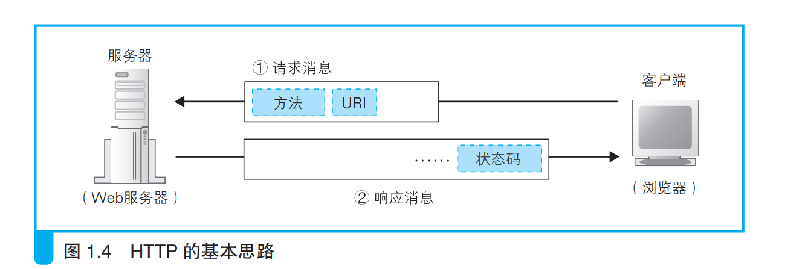
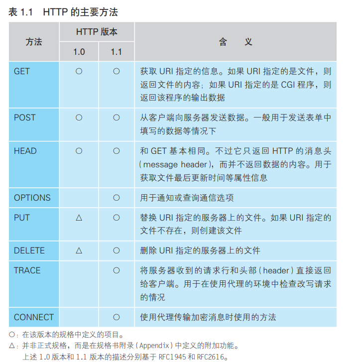

### HTTP的基本思路
---

- HTTP协议是客户端和服务端在发送消息的过程中需要遵守的规则。
 

- 客户端浏览器向服务端发送请求消息时，一般要发送请求方法和URI。
 

- 其中请求方法是指服务器要怎样处理客户端发送过来的请求，比如get请求就是向客户端返回内容；
 

- URI则是客户端指定要访问的服务器中的文件，一般可以用URL来作为URI，也可以使用CGI程序，比如服务器中有某个文件叫program.cgi，这时客户端将数据发送给该文件，该文件中的程序处理完数据得到的结果响应给客户端。
---

URI：Uniform Resource Identifier，统一资源标识符。

CGI 程序：对 Web 服务器程序调用其他程序的规则所做的定义就是 CGI， 而按照 CGI 规范来工作的程序就称为 CGI 程序。

客户端向浏览器发送消息时还会附带一些信息，比如数据之类的。这些信息组成头字段，客户端发送消息时一般会把头字段放在消息的最前面

---

##### 客户端请求消息中的方法如下

 

- 服务器在接收到客户端的消息后，会将状态码和客户端请求的信息作为响应消息发送给浏览器。
 

- 其中状态码表示服务器对客户端请求的处理结果。我们有时见到的404就是一种状态码，表示没有找到服务器。

