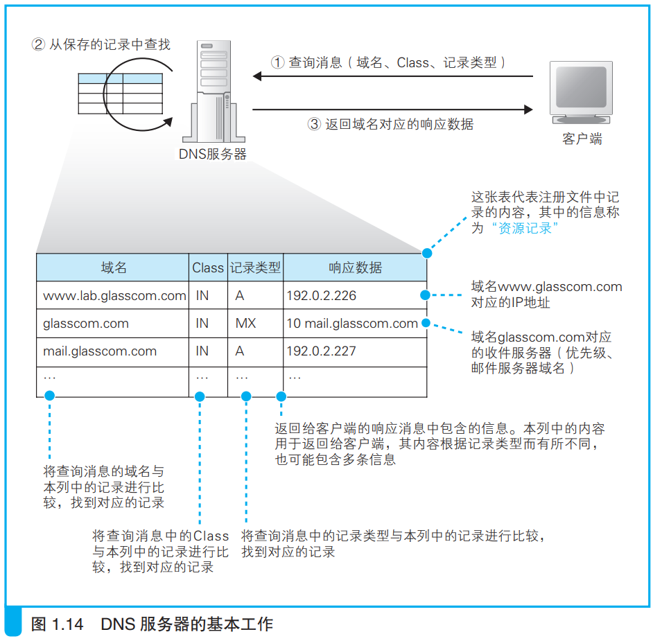

### DNS服务器的基本工作

DNS服务器接收客户端请求消息，然后返回响应消息

---

客户端查询消息一般包含以下三种信息
1. 域名
服务器、邮件服务器（邮件地址中 @ 后面的部分）的名称
 

2. Class
在最早设计 DNS 方案时，DNS 在互联网以外的其他网络中的应用也被考虑到了，而 Class 就是用来识别网络的信息。不过，如今除了互联网并没有其他的网络了，因此 Class 的值永远是代表互联网的IN
 

3. 记录类型
表示域名对应何种类型的记录。例如，当类型为 A 时，表示域名
对应的是 IP 地址；当类型为 MX 时，表示域名对应的是邮件服务
器。对于不同的记录类型，服务器向客户端返回的信息也会不同

DNS服务器中提前保存了这三种信息对应的记录，并根据请求消息中的三种信息作出响应，如下所示

上图所示表格中的信息保存在配置文件中，表格的一行称为一条资源记录。

---
说明
- A 是 Address 的缩写。

- MX：Mail eXchange，邮件交换。

- 当访问邮件服务器如abc@glasscom.com时，需要的域名是@后面的那一段，也就是\\glasscom.com\\。

- 查询邮件服务器域名返回的结果除了ip地址外还有优先级（一个整数）。当一个邮件地址对应多个邮件服务器时，需要根据优先级来判断哪个邮件服务器是优先的。优先级数值较小的邮件服务器代表更优先。
---

