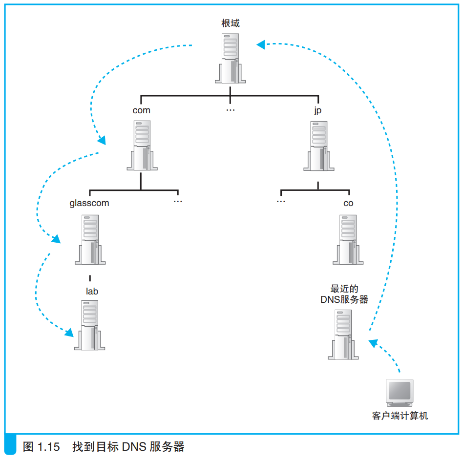
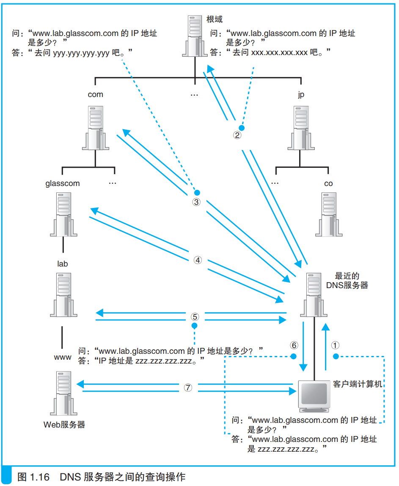

### 寻找相应的 DNS 服务器并获取 IP 地址

下层DNS服务器的ip地址会注册到上一层的DNS服务器中，上一层会注册到更上一层的DNS服务器中。那么查询时就可以从最上层开始往下查，直到查询出目标服务器的地址。

最上层的DNS服务器中存储着根域的信息，一般url中忽略根域的声明。根域中包含着com域、cn域等上层域的DNS服务器的地址信息。

全世界所有的DNS服务器中都包含根域DNS服务器的信息，因此从任意一台DNS服务器都可以找到目标服务器。

查找ip地址的过程如下

