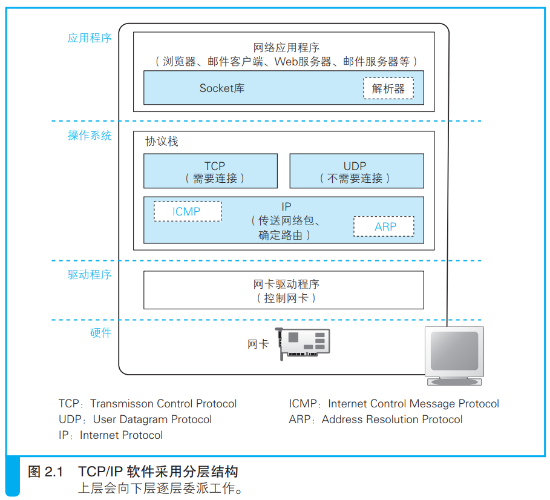

### 协议栈的内部结构

 操作系统使用软件（协议栈）和硬件（网卡）发送消息。

> 协议栈的功能如图所示

数据被切分为一个个小小的网络包在互联网上传输，传输操作由IP协议来控制。

IP协议还包含ICMP协议和ARP协议，ICMP协议用来报告传输过程中的报错和控制信息，ARP协议用来根据IP地址查询以太网中的MAC地址。
<i>MAC 地址：符合 IEEE 规格的局域网设备都使用同一格式的地址，这种地址被称为 MAC 地址。</i>

IP下面的网卡驱动负责控制网卡硬件，实际的网络信号信息收发都是由网卡来实现的。