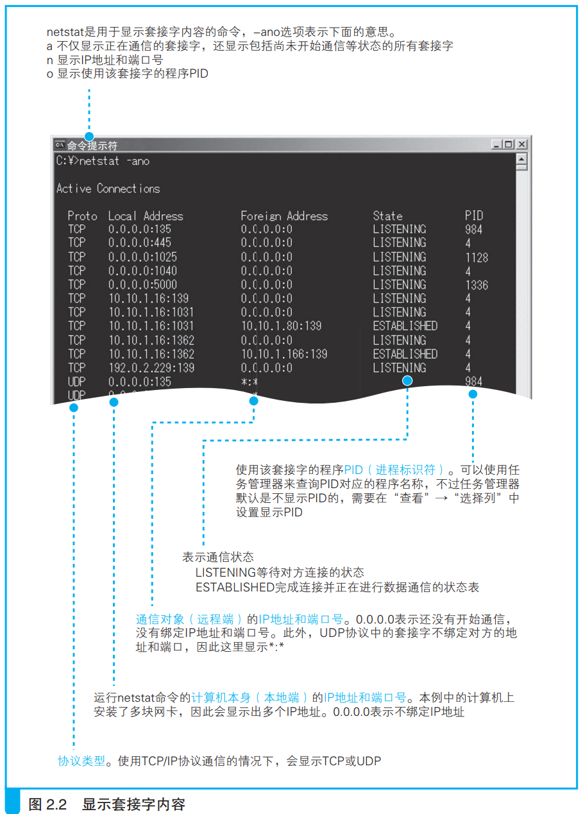

### 套接字的实体就是通信控制信息

在协议栈内部有一块用于存放通信控制信息的内存空间，控制信息包含了目标服务器的ip地址，端口号，通信状态等。套接字本身没有实体，可以认为控制信息或者该内存空间就是套接字。

协议栈会根据套接字中的控制信息如Ip地址来选择将请求消息发送到哪儿，然后需要等待响应，为了防止等待响应时间过长，套接字中会记录响应是否完成以及等待响应过去了多久,协议栈根据这些信息决定是否重发消息。

> 在Windows中可以使用netstat命令查看套接字。终端中的每一行都是控制信息，创建一个套接字就增加一行并进行通信准备工作。
>
> 
>> 如图中第一行控制信息，本地PID为984的程序正在135端口运行，可以看到本地和目标服务器地址都为0，这表示通信还没开始。
>>第八行控制信息显示，PID为4的程序正在本机1031端口运行，通信的服务器地址为10.10.1.80，端口号为139

- <i>PID：Process ID（进程标识符）的缩写，是操作系统为了标识程序而分配的编号，使用任务管理器可以查询所对应的程序名称。</i>
- <i>对于处于等待连接状态的套接字，也可以绑定 IP 地址，如果绑定了 IP 地址，那么除绑定的 IP 地址之外，对其他地址进行连接操作都会出错。当服务器上安装有多块网卡时，可以用这种方式来限制只能连接到特定的网卡</i>

