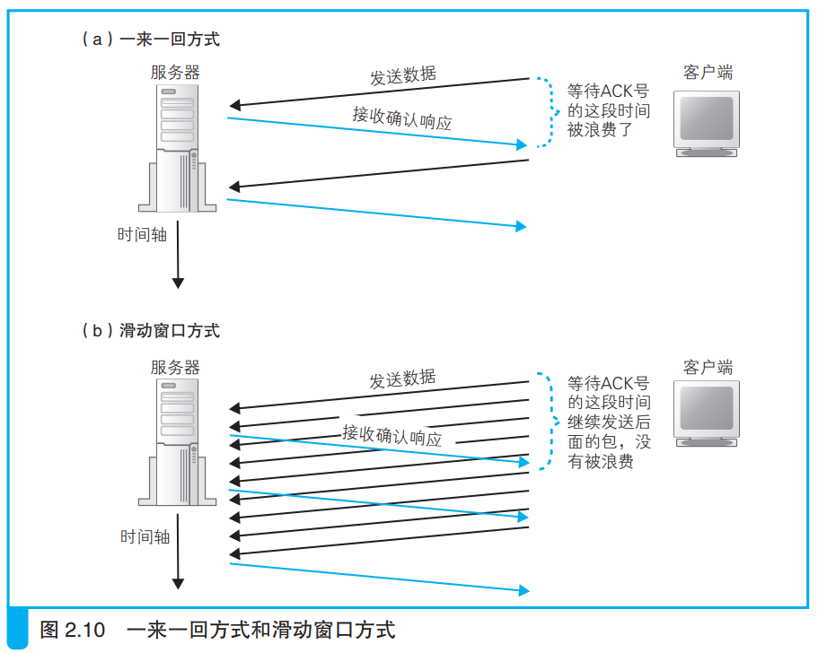
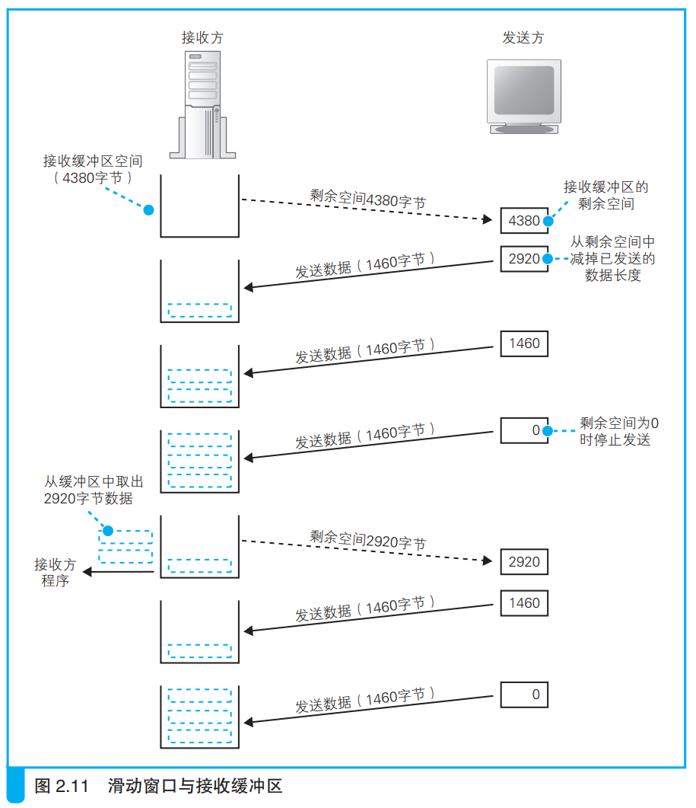

### 使用窗口有效管理 ACK 号

发送一次数据就等待一次ACK号的效率很慢，因此TCP通过滑动窗口的方式提高效率，如下所示：

这种方式存在一个问题，接收方将收到的数据放在接收缓冲区中，如果应用程序处理数据的速率低于客户端发送数据的速率的话，那么就很容易出现接收缓冲区溢出的情况。
为了防止这种情况，需要在客户端发送数据前就先将能接受的最大数据量大小（窗口大小，一般和缓冲区容量一样）告诉客户端。这段信息放在TCP窗口字段中。如下所示：

上图简单表示了从客户端向服务端发送数据，实际上的数据接收是双向的。