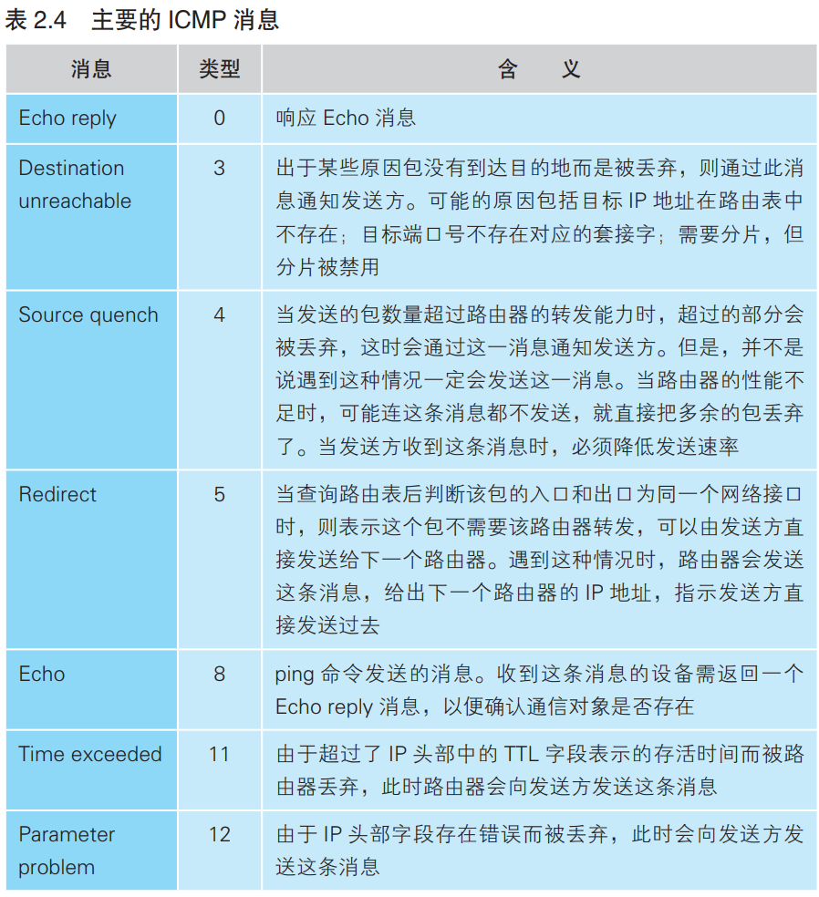

### 将服务器的响应包从 IP 传递给 TCP

IP模块收到IP包后，先检查IP头部格式是否正确，然后检查接收方IP地址是否与自己的IP地址一致。

客户端没有转发包的功能，如果收到的包的接收方ip地址与自己的ip地址不一致，说明出现了错误。这时IP模块就会通过ICMP消息把错误告知发送方。

如果IP地址确认无误，接下来还需要进行分片重组。网络中的包都是以小包的形式发送，这些包属于一个大包，它们都有同一个ID，以此判断是否属于同一个大包，同时还有分片偏移量（fragment offset）来判断它们在大包中的位置，通过这些信息就可以将小包重组为大包。

IP模块工作结束，将网络包交给TCP模块。TCP模块根据IP头部的发送方IP地址和接收方IP地址，及TCP头部中的发送方端口和接收方端口来确定套接字，然后根据套接字中的通信状态信息进行相应的操作。比如数据收发就返回确认接收消息，断开连接就返回响应控制包。

