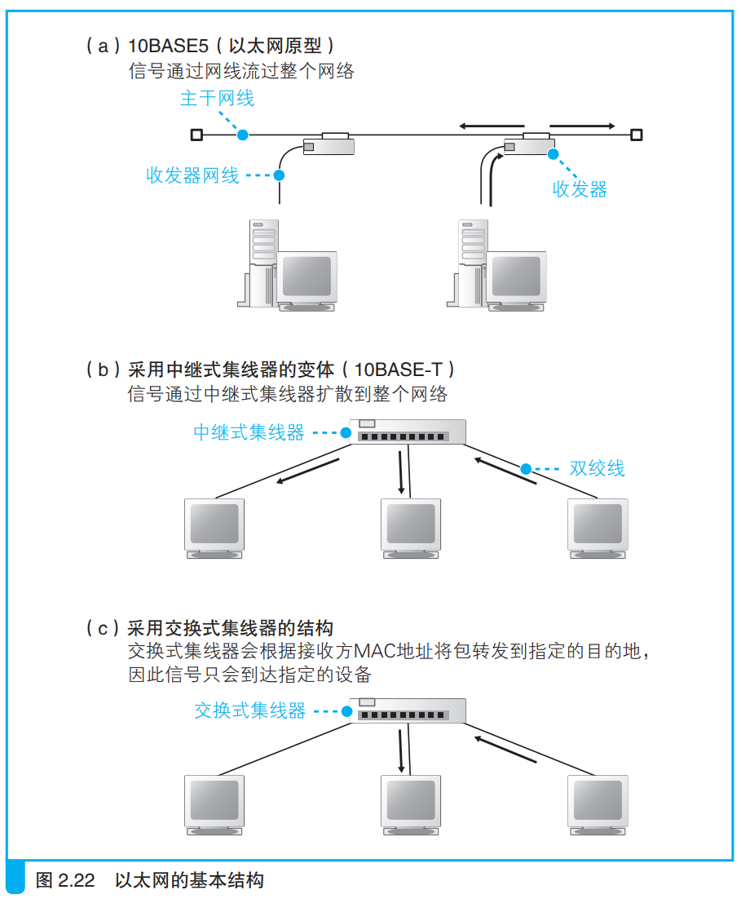

### 以太网的基本知识

> 以太网是一种为多台计算机能够彼此自由和廉价地相互通信而设计的通信技术

图a原始以太网通过一条网线连接计算机，其中一台计算机发送网络包后，所有计算机都能接收到，随后网络包MAC地址对应的计算机保留网络包，其余计算机丢弃。

图b将图a的主干网线用中继式集线器代替，收发器网线用双绞线代替。

图c中网络包不再发送给所有计算机，而是只发给目标计算机。

---

> 以太网具备的三个性质：
> 1. 发送方MAC地址识别发送方
> 2. 接收方MAC地址识别接收方
> 3. 以太网类型识别包的内容
>
> 可以认为具备具备以上三点的就是以太网