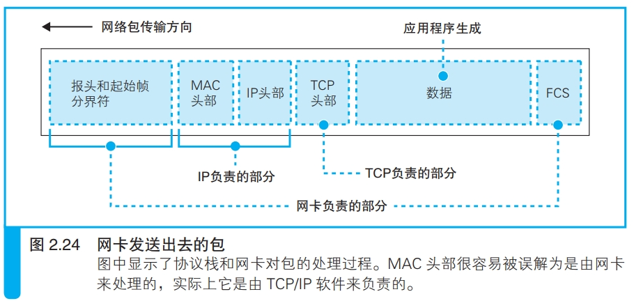
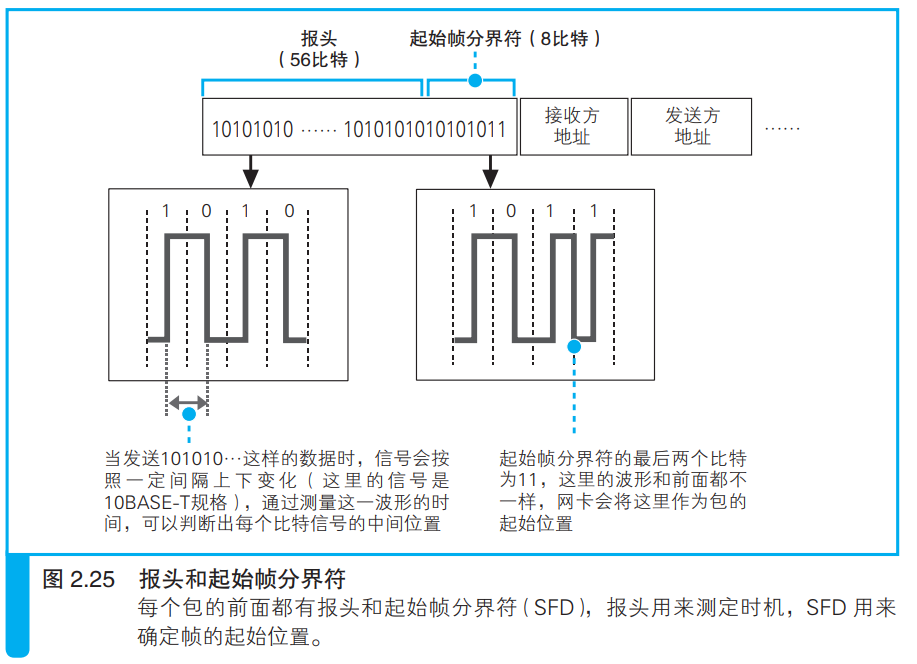
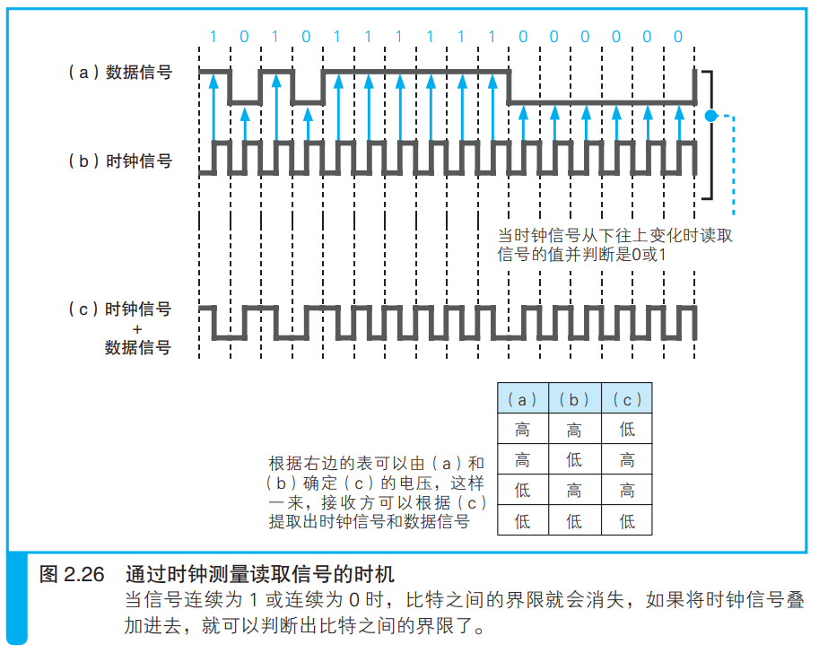

### 给网络包再加 3 个控制数据

网卡从IP模块获取包后，将包复制到网卡内部的缓冲区，然后让MAC模块发送包

MAC模块从缓冲区取出包，在包头加上报头和起始帧分界符，在尾部加上检验错误的帧校验序列。
<i>以太网术语中“帧”就是“包”</i>

报头用于确定包的读取时机

如下图所示，通过电流电压变化可以得知数字信息：

上图中用a和b可以识别连续相同信号部分的数字信息。但如果网络传输距离过长，就会出现偏移。

将a和b叠加得到c，读取时根据时钟周期得到b，根据c和b得到a。

报头中有测量时钟信号的特殊信号，可以用来测算时钟信号的变化周期。

起始分界符是一个用来表示包起始位置的标志。

FCS（帧校验序列）是对包中全部数据使用某个公式得到的32比特的序列，如果在传输过程中包数据受到噪声影响产生变化，那么接收方计算得到的FCS就会与发送方发过来的FCS不同，于是就得知了包中数据是否正确。

