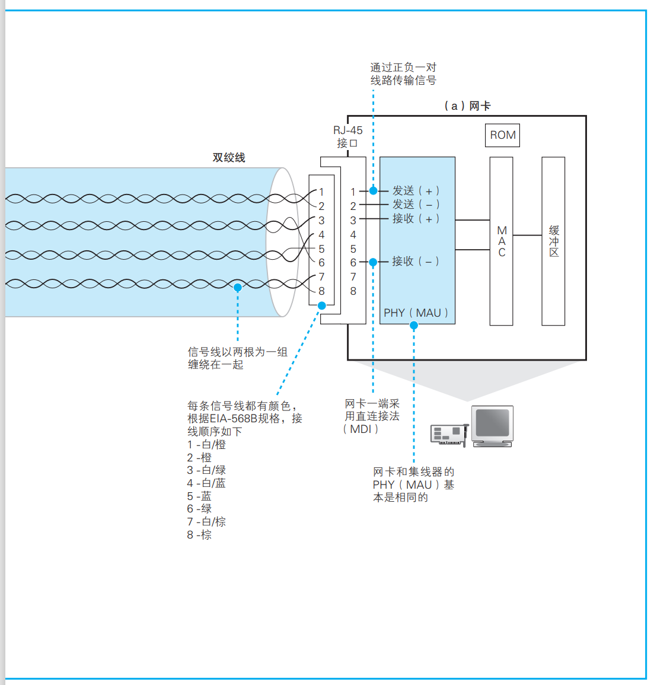
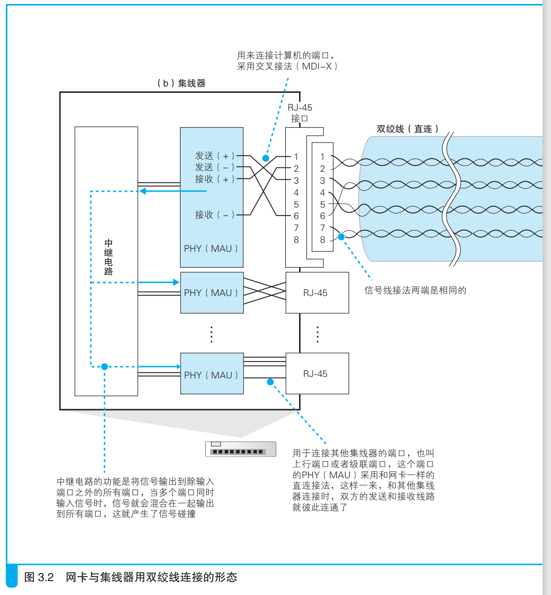
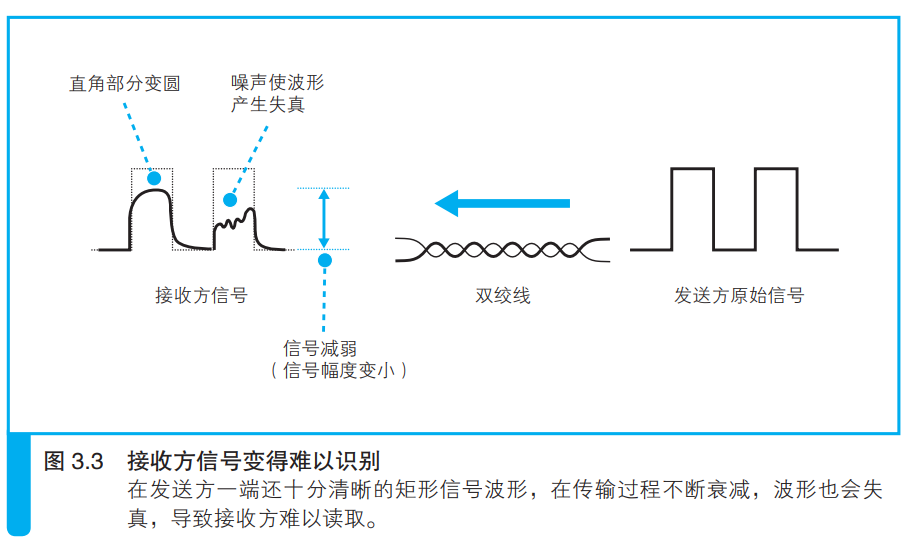

### 防止网线中的信号衰减很重要

网卡的PHY(MAU)将包转换成电信号，可以认为PHY(MAU)就是一个从正负两个信号端子输出信号的电路，信号通过RJ-45接口进入双绞线，如下图右侧所示：

上图中，电信号从RJ-45接口的1号2号针脚流入，在网线传输的过程中出现能量损失，网线越长损失越大，信号衰减越严重，等传到集线器时就出现了失真。

如上图所示，越是高频信号就越容易出现信号衰减，这是因为高频信号的产生盘随着大量电磁波，带走了一部分能量。

