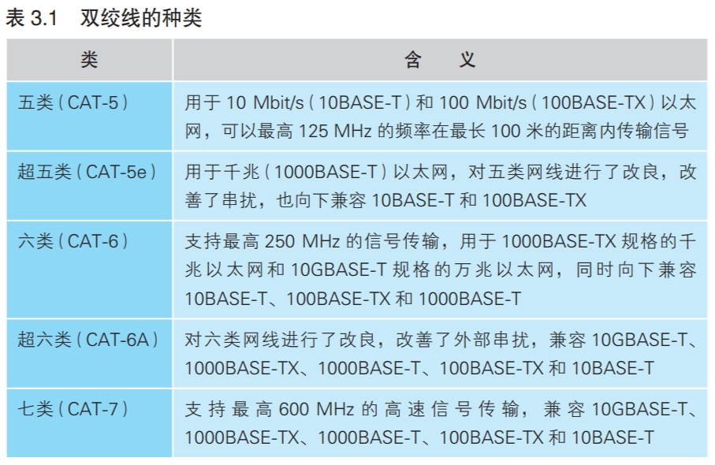

### “双绞”是为了抑制噪声

双绞线就是两条信号线为一组，按扭麻花的方式扭在一起。这种方式应用在局域网中，可以有效抑制噪声。

噪声产生的原因：网线周围的电磁波接触到金属导体，就会在其中产生电流。

噪声来源有两种，一种是电机、荧光灯、CRT显示屏等外设泄露出来的电磁波。将两根信号线缠绕在一起，信号线中噪声电流方向相反，就会相互抵消，抑制噪声。如下所示：

另一种噪声来源于相邻网线。相邻网线中传出的电磁波由于距离太小，也会产生干扰作用，这种噪声称为串扰。正负信号线产生的噪声电流方向相反，两者就会抵消。从网线整体来看，正负信号线的分布保持平衡，自然就会削弱噪声的影响

除了缠绕，还可以通过在信号线间增加隔板，在导线外使用金属屏蔽网隔绝电磁波的方式抑制噪声，提升网线传输性能。

网线性能以“类”区分，市售主要种类如下：

