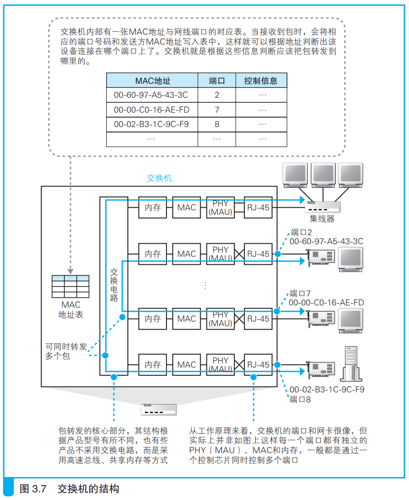
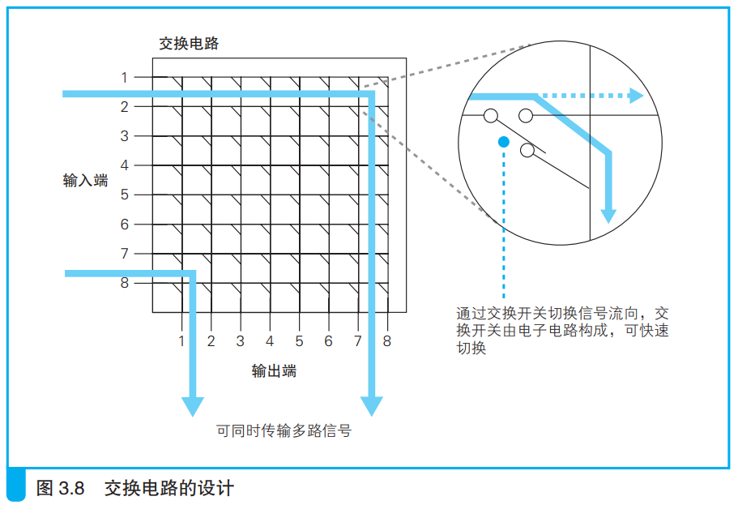
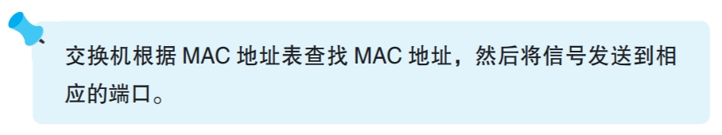

### 交换机根据地址表进行转发

交换机将网络包转发到目的地。如下图所示：

信号通过双绞线到达交换机的PHY(MAU)模块，其将网线中的信号转换为通用格式交给MAC模块。

MAC将电信号转换为数字信息，然后检验FCS序列，没问题就放在缓冲区中。操作和网卡基本相同。

MAC地址表中的MAC地址是接收方MAC地址，端口是交换机端口。根据MAC地址表和网络包中接受方的MAC地址就得到对应的端口号。通过交换电路将网络包发给对应的端口。

交换电路的交换开关通过电子控制，改变交换开关的状态就能改变信号流向。

网络包到了端口后，端口的PHY(MAU)模块和MAC模块进行收发操作，这和网卡是一样的。要检测接收线路有没有信号发送过来，如果有就需要等待；如果在发送期间有其它信号传输，说明出现了信号碰撞，此时需要发送阻塞信号停止信号传输，这和网卡的操作也是一样的。

