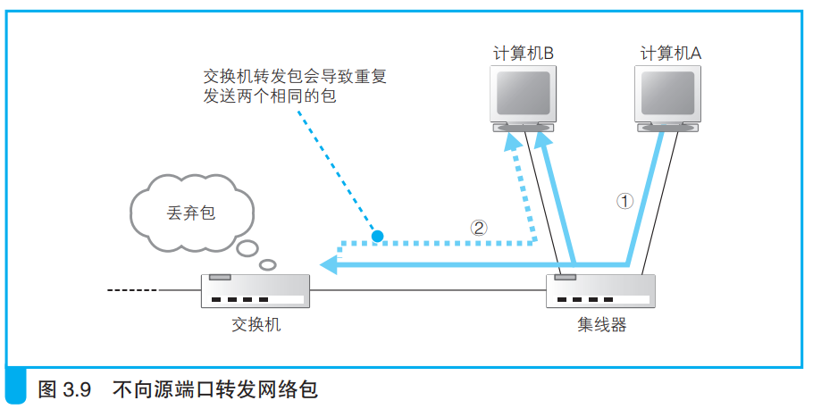

### 特殊操作

交换机在转发包时发现包的接收端口和发送端口是同一个端口，如下所示：

此时直接丢弃这个包。

交换机在转发包时发现MAC地址中没有对应记录，就把这个包转发给所有设备，等到那个设备返回相应信息时记录到MAC地址中。

接收包的MAC地址是广播地址，交换机就将它转发给除源设备外的所有设备。

> <i>广播地址（broadcast address）是一种特殊的地址，将广播地址设为接收方地址时，包会发送到网络中所有的设备。MAC 地址中的 FF:FF:FF:FF:FF:FF和 IP 地址中的 255.255.255.255 都是广播地址。</i>

