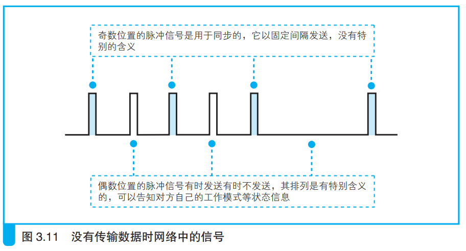
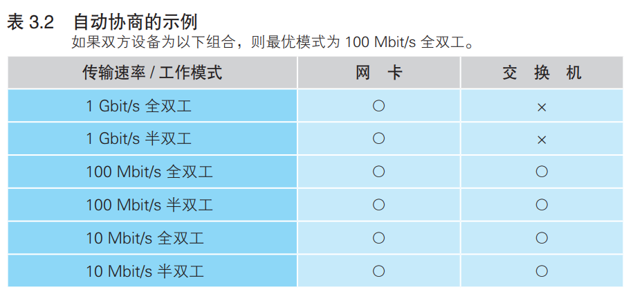

### 自动协商：确定最优的传输速率

> 自动切换工作模式可以在全双工和半双工模式之间进行切换，该模式有这些功能：
>
> 1. 连接双方判断对方是否支持全双工，并自动切换合适的工作模式;
>
> 2. 探测对方传输速率并进行自动切换，这种功能称为自动协商。

在以太网中，没有数据传输时，网络中会填充一种称为连接脉冲的脉冲信号。

在网络设备的连接接口附近有一个绿色的LED指示灯，当正常接收到脉冲信号指示灯就亮，表示PHY(MAU)模块和网线连接正常。

通过以下特定序列的脉冲信号可以将自身工作状态告知连接对方，自动协商利用这种信号传输连接双方的工作模式和传输速率。

双方设备信息如下，设备通电并完成初始化后就向对方发送脉冲信号传递自身信息，双方设备读取信号后选择优先级最高的方案，即为100Mbit/s 全双工。

