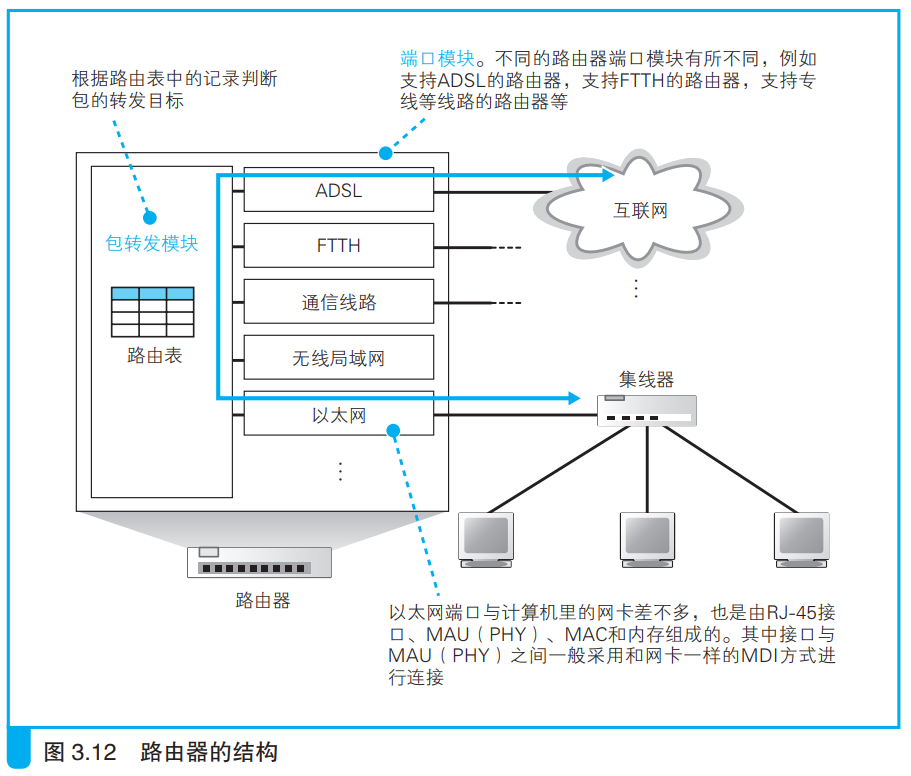

### 路由器的基本知识

路由器基于IP设计，其内部结构如下所示：

路由器包括转发模块和端口模块，转发模块判断目的地，端口模块负责转发。

路由器中安装了以太网等多种通信技术的硬件，因此端口模块支持多种通信技术的信号传输。

---

网络包传输到路由器后由端口模块中对应的硬件接收，然后交给转发模块。

转发模块查询IP头部的接收方IP地址，然后通过路由表得到接收方对应端口，于是将网络包交给对应端口转发。

---

路由器端口有自己的MAC地址和IP地址，端口检查接收到的包中的MAC头部的接收方MAC地址，是自己才会接收，否则就丢弃。

交换机没有自己的MAC地址，只负责转发包。

